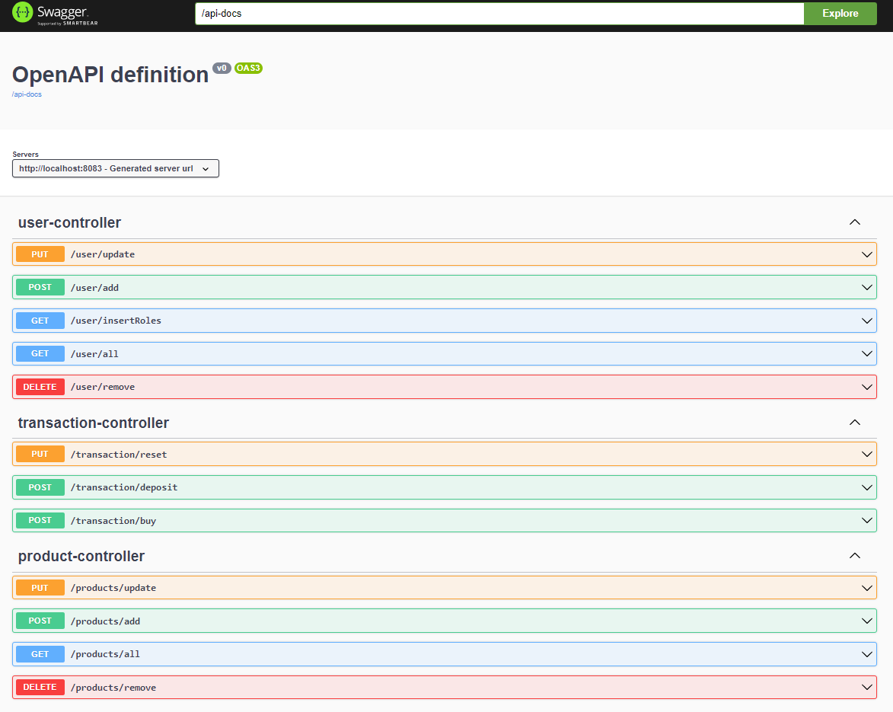

# VendingMachine

API for a vending machine

### Technology Stack
Java 11, Maven, Spring Boot, H2, Docker

### Clone
To get started you can simply clone this repository using git:
```
git clone https://github.com/sinanmutlu/VendingMachine.git
cd vendingmachine
```

### Running the application locally

There are several ways to run a Spring Boot application on your local machine. 

One way is to execute the `main` method in the `com.sinanmutlu.vendingmachine.VendingmachineApplication` class from your IDE.

Alternatively you can use the [Spring Boot Maven plugin](https://docs.spring.io/spring-boot/docs/current/reference/html/build-tool-plugins-maven-plugin.html) like so:

```shell
mvn spring-boot:run
```

### Build an executable JAR

Or you can build a single executable JAR file that contains all the necessary dependencies, classes, and resources with:
```
mvn clean package
```
Then you can run the JAR file with:
```
java -jar .\target\vendingmachine-0.0.1-SNAPSHOT.jar
```

### Test the application

   On your browser open [Swagger UI](localhost:8083/swagger-ui/index.html) to
   reach api docs and test apis.
   



* You need to add users `/user/add` first. User can have roles: "SELLER", "BUYER" or "SELLER,BUYER"


* Then you can add products `products/add` with userId(user's role should contain "SELLER")


* Finally you can deposit `/transaction/deposit` and buy products `/transaction/buy` with userId(user's role should contain "BUYER")